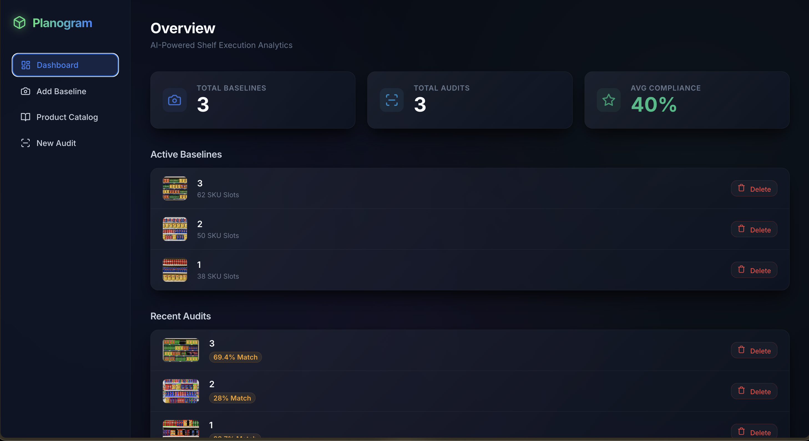
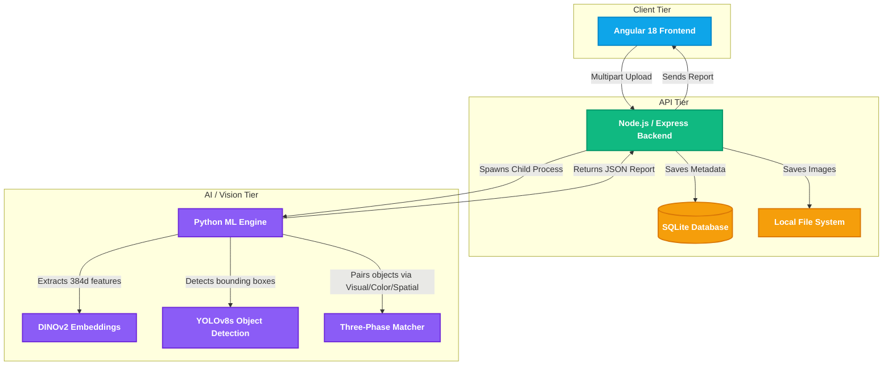
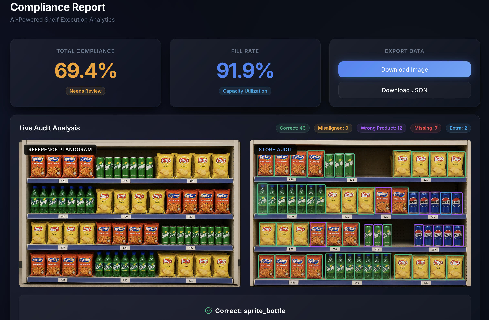
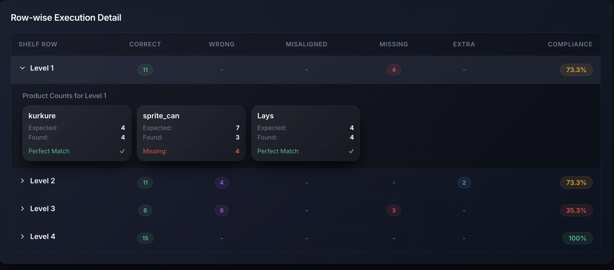
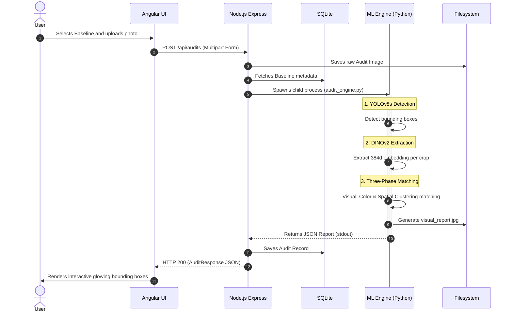

# Planogram - AI-Powered Shelf Execution Analytics

Planogram is an intelligent, AI-powered computer vision platform designed to automate retail shelf compliance and auditing. By combining state-of-the-art vision models with a highly responsive dashboard, Planogram compares store shelves in real-time against reference baselines to instantly identify missing, extra, or incorrectly placed products.

<div align="center">
  
</div>

## Key Features

- **Advanced Visual Fingerprinting**: Utilizes Meta's **DINOv2** self-supervised vision transformer to extract 384-dimensional semantic embeddings from product crops.
- **Intelligent Object Detection**: Powered by **YOLOv8s** for real-time bounding box detection of products on shelves.
- **Three-Phase Matching Algorithm**: Uses a sophisticated heuristic engine that combines:
  1. **Visual Similarity (DINOv2 + ORB)**: Matches high-level semantic embeddings and low-level keypoint features.
  2. **Color Similarity (HSV Histograms)**: Matches color profiles to disambiguate visually similar products.
  3. **Spatial Y-Coordinate Clustering**: Groups products into row-levels and performs localized bipartite matching (Hungarian Algorithm) strictly within shelves.
- **Responsive Modern UI**: Features a stunning, glassmorphic UI built with Angular 18.
- **Real-time Compliance Dashboards**: Instantly view metrics like Total Baselines, Avg Compliance, and Row-Wise breakdown stats.

---

## 🏗 System Architecture

Planogram is designed using a modern microservice-style architecture. This allows the compute-heavy Python machine learning tasks to be decoupled from the real-time Node.js backend.



---

## 🔍 How It Works: The Audit Workflow

<div align="center">
  
</div>

### Row-Wise Execution Detail

<div align="center">
  
</div>

When an auditor takes a picture of a store shelf, the image is sent through a rigorous ML pipeline to generate the interactive bounding boxes and row-by-row execution details you see in the UI.



---

## 🛠 Technologies Used

* **Frontend**: Angular 18, TypeScript, custom SCSS, Lucide Icons, Glassmorphism UI
* **Backend**: Node.js, Express.js, TypeScript, SQLite
* **Machine Learning**: Python, PyTorch, YOLOv8s (Ultralytics), DINOv2 (Meta), OpenCV, SciPy

---

## 🚀 Setup & Installation (Windows / Mac)

### Prerequisites
- Node.js (v18+)
- Python (3.10+)
- Angular CLI (`npm install -g @angular/cli`)

### 1. Setup the Python ML Environment
```bash
python -m venv planogram_env

# Windows
planogram_env\Scripts\activate      

# Mac/Linux
source planogram_env/bin/activate

# Install all dependencies (allows pip to fetch pre-compiled versions)
pip install -r requirements.txt
```
*(Note: YOLOv8s weights (`best_model_yolov8s.pt`) must be present in the `ml-service/notebooks/test/` directory)*

### 2. Start the Backend Server
⚠️ **CRITICAL:** You must activate the Python virtual environment in the terminal before starting the backend, otherwise the machine learning pipeline will fail to find your installed libraries (like OpenCV and YOLO).

Open a new terminal window:
```bash
# First, activate the environment again in this new terminal
planogram_env\Scripts\activate      # Windows
# source planogram_env/bin/activate # Mac/Linux

# Then start the server
cd backend
npm install
npm start
```
*(The backend runs on `http://localhost:3000`)*

### 3. Start the Frontend Application
Open a new terminal window:
```bash
cd frontend
npm install
npm start
```
*(The frontend runs on `http://localhost:4200`)*

---
*Built for the future of retail execution.*
