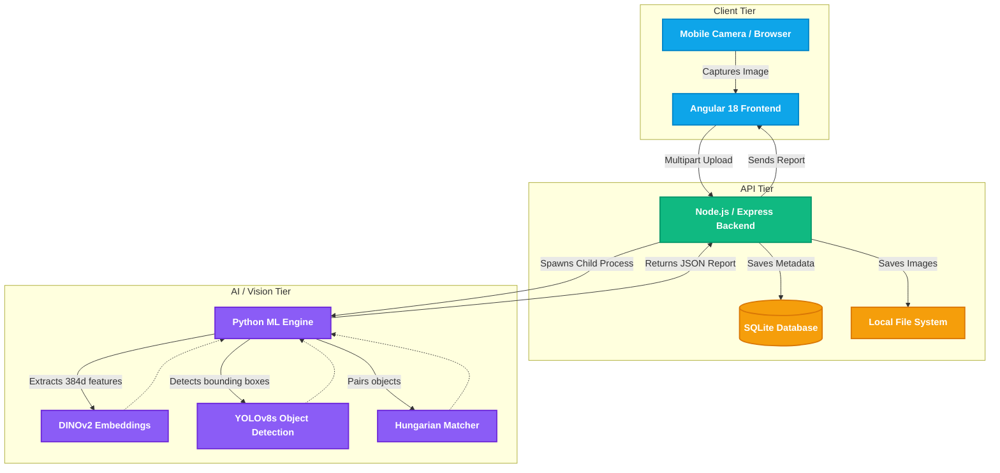

# System Architecture

Planogram is designed using a modern microservice-style architecture. This allows the compute-heavy Python machine learning tasks to be decoupled from the real-time Node.js backend.

## High-Level Architecture Diagram

### Components:
1. **Frontend (Angular)**: Handles the UI, state routing, and device camera integration.
2. **Backend (Node.js)**: Orchestrates data flow, serves static files, and executes the Python ML scripts as child processes to avoid blocking the main event loop.
3. **ML Engine (Python)**: Uses YOLOv8s to slice up the shelf image into individual product crops, and DINOv2 to compute high-dimensional visual fingerprints for each crop.
