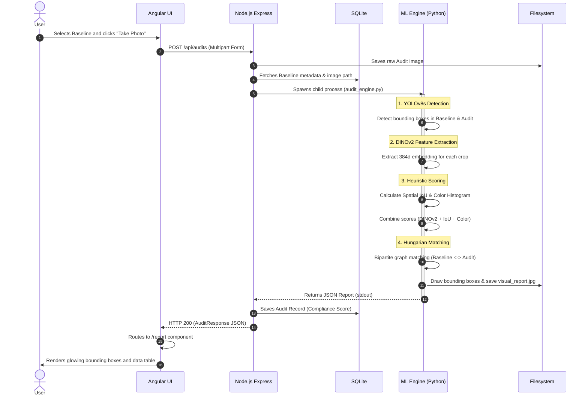

# Audit Workflow

This document explains the data flow from the moment a user uploads an audit image until the final compliance report is rendered on the screen.

## Sequence Diagram

### Steps Explained:
1. **Upload**: The user captures an image and it is sent to the Node.js backend.
2. **Execution**: The backend calls the Python script, passing the paths to the Baseline and Audit images.
3. **Detection**: YOLOv8s finds all products on the shelf.
4. **Feature Extraction**: DINOv2 converts those products into deep mathematical representations (embeddings).
5. **Matching**: The Hungarian algorithm matches the products from the baseline to the products on the actual shelf to find exactly what is missing, extra, or incorrectly placed.
6. **Rendering**: The Angular frontend overlays the results as interactive bounding boxes.
